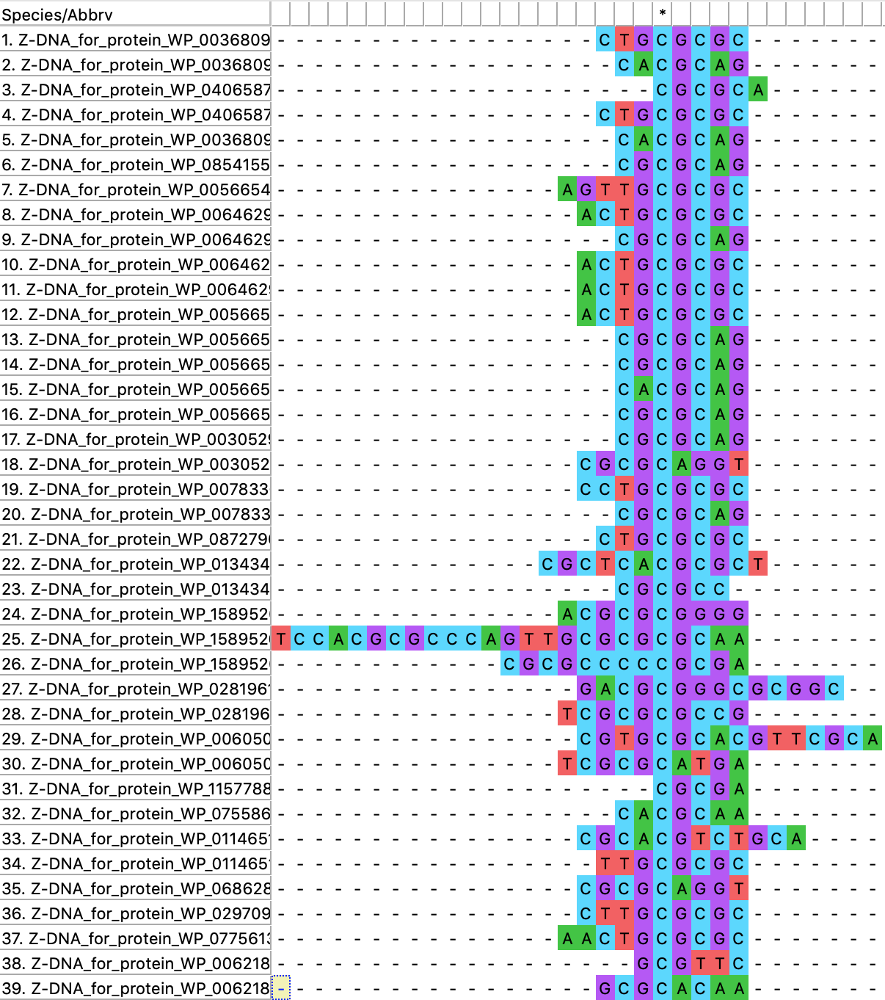
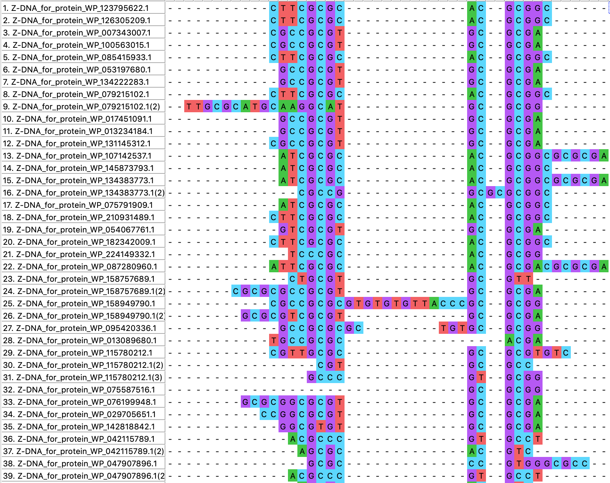
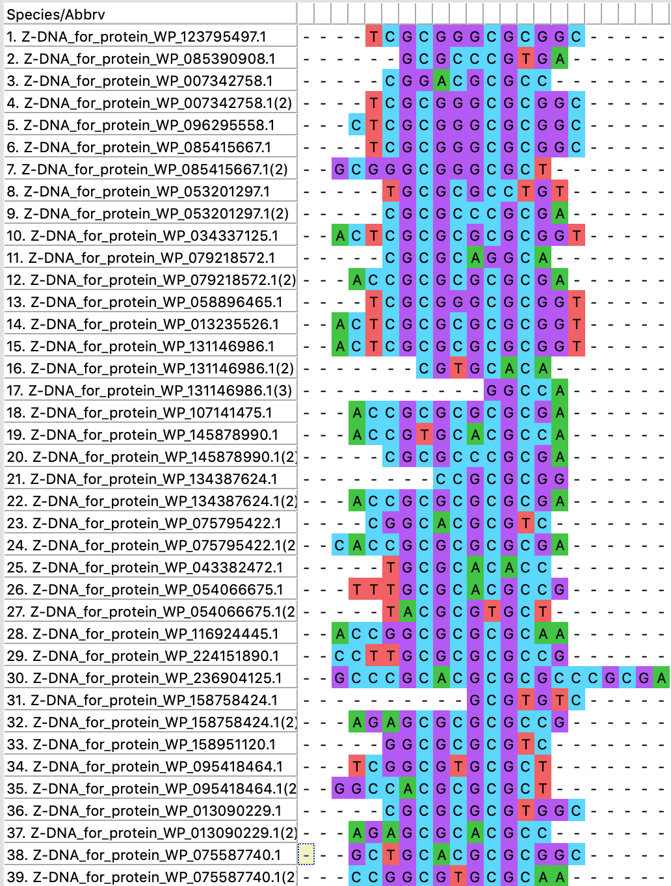

# hse_bioinformatics_project

## Ссылка на колаб
```
https://colab.research.google.com/drive/1RvTO_LC13N4MDVttYmIaI39VBFaTSFgg?usp=sharing
```
## Участники
ФИО |Факультет |Группа |ВИД| Род|GitHub|
|---|---|---|---|---|---
Белова	Олеся	|ФХ|	3	|Betaproteobacteria|	Neisseria |https://github.com/OlesyaBelova/hse22_finalproject|
Княжевский	Владимир|	ФКН	|1|	Betaproteobacteria|	Herbaspirillum|https://github.com/grammar-anarchist/hse22_project|
Кулешова	Полина|	ФКН	|2|	Betaproteobacteria|	Massilia| https://github.com/Polindromka/hse22_project|
Овчинникова	Анастасия	|МИЭМ	|3	|Betaproteobacteria	|Comamonas|https://github.com/ytken/hse22_project|
Савинов 	Максим	|ФКН|	2	|Betaproteobacteria|	Paraburkholderia|https://github.com/MaksimSavinov/hse22_project|
Ершов	Кирилл	|ФКН|	1|	Betaproteobacteria	|Rhodoferax|https://github.com/zdikov/hse22_project|
Поморцев	Леонид	|ВШБ|	2|	Betaproteobacteria|	Pandoraea| https://github.com/harspect/hse22_project|
Попов	Игорь	|ФКН|	2	|Betaproteobacteria|	Bordetella|https://github.com/ispopov1/hse22_project/blob/main/README.md|
Космачев	Алексей|	МИЭМ|	2	|Betaproteobacteria	|Acidovorax|https://github.com/TheMostKnown/hse22_project|
Антонников 	Григорий|	ВШБ	|1|	Betaproteobacteria|	Сupriavidus, Bordetella|https://github.com/greggasd/hse22_project|
## Сводная таблица

## Heatmap


## Clusters


## Выравнивание

### Аминокислотное CrustalW
#### MULTISPECIES: 30S ribosomal protein S21


#### glutamine-hydrolyzing GMP synthase

#### transcription antitermination factor NusB


### Нуклеотидное (Z-ДНК)
#### MULTISPECIES: 30S ribosomal protein S21


#### glutamine-hydrolyzing GMP synthase

#### transcription antitermination factor NusB



